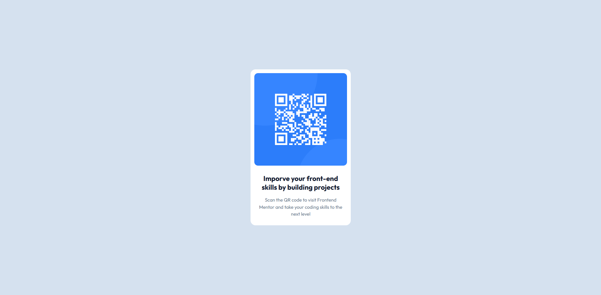

# Frontend Mentor - QR code component solution

This is a solution to the [QR code component challenge on Frontend Mentor](https://www.frontendmentor.io/challenges/qr-code-component-iux_sIO_H). Frontend Mentor challenges help you improve your coding skills by building realistic projects. 

## Table of contents

- [Overview](#overview)
  - [Screenshot](#screenshot)
  - [Links](#links)
- [My process](#my-process)
  - [Built with](#built-with)
  - [What I learned](#what-i-learned)
- [Author](#author)
- [Acknowledgments](#acknowledgments)

**Note: Delete this note and update the table of contents based on what sections you keep.**

## Overview

### Screenshot




### Links

- Live Site URL: [Add live site URL here](https://fementor-qr-2.vercel.app/)

## My process

### Built with

- Semantic HTML5 markup
- Flexbox
- Mobile-first workflow
- [Tailwind](https://tailwindcss.com/) - CSS Framework


**Note: These are just examples. Delete this note and replace the list above with your own choices**

### What I learned

To be honnest, im not learn anything new but just practice my tailwind skills like
```html
<div class="flex flex-col p-3 max-w-80 bg-[#ffffff] rounded-2xl">
	
	<div class="mt-4 p-3 space-y-4">
		<p class="text-slate-900 font-bold text-lg text-center leading-tight">Imporve your front-end skills by building projects</p>
		<p class="text-slate-500 font-base text-base text-center">Scan the QR code to visit Frontend Mentor and take your coding skills to the next level</p>
	</div>
</div>
```

## Author

- Website - [Add your name here](https://www.your-site.com)
- Frontend Mentor - [@yourusername](https://www.frontendmentor.io/profile/yourusername)
- Twitter - [@yourusername](https://www.twitter.com/yourusername)

**Note: Delete this note and add/remove/edit lines above based on what links you'd like to share.**

## Acknowledgments

just do it

**Note: Delete this note and edit this section's content as necessary. If you completed this challenge by yourself, feel free to delete this section entirely.**
